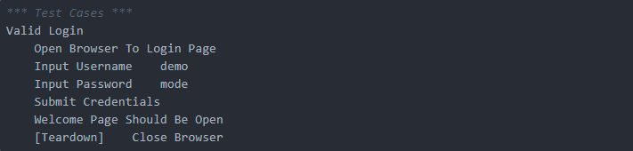

# Robot Framework Selenium Test Example

## Ví dụ 1:

### Tìm hiểu về websites đặt vé máy bay

#### Bước 1: Mở link http://blazedemo.com/

#### Bước 2: Chọn nơi khởi hành là Paris
#### Bước 3: Chọn nơi đến là London
#### Bước 4: Chọn Find Flights
#### Bước 5: Xem kết quả tìm kiếm


### Thay vì chúng ta phải vào link code và thực hiện mọi thứ bằng tay thì chúng ta có thể dùng Robot Framework để thực hiện việc này

#### Bước 1: Tạo folder mới (Các bạn có thể đặt tên mà các bạn mong muốn)
#### Bước 2: Tạo file mới có tên là search_flights.robot.
#### Bước 3:  Tạo file mới có tên là Search_flights_keywords.robot.
 


Note:
- Thành phần cơ bản của một file kịch bản của Robot Framework gồm 3 phần chính: Settings, Test Cases và Keywords.
- Phần Settings sẽ định nghĩa các thành thiết lập khởi đầu cho kịch bản, như là mô tả xem nó sẽ làm gì, dùng thư viện nào.

- Gồm các thành phần:
  - Documentation: Mô tả khái quát về nội dung test.
  - Suite Setup/Teardown: Gọi đến các Keywords để khi bắt đầu/kết thúc chạy test.
  - Resource: Import các file khác để tái sử dụng lại các Keywords.
  - Library: Import các thư viện hỗ trợ test.
- Phần Test Cases là phần chính bao gồm các trường hợp cần test, trong phần này ta chỉ cần gọi các Keywords để chúng chạy và kiểm tra xem Output có đúng với Expected không.

- Keywords là các step từ chuẩn bị cho đến việc kiểm tra kết quả, Robot là thế giới của các keywords. Trong keywords chúng ta cũng gọi đến những keywords khác để thực hiện các xử lý.


Lưu ý: Không code theo các phần của note.

#### Bước 4:Mở file search_flights.robot và thêm nội dung như sau:

#### Bước 5: Chạy file search_flights.robot bằng cách mở terminal và gõ lệnh sau:
```angular2html
    robot search_flights.robot
```
#### Bước 6: Kết quả chạy:


#### Các file tạo ra sau khi chạy
- log.html: Lưu lại các thông tin về các bước thực hiện của test.

[//]: # (![img_6.png]&#40;img_6.png&#41;)
- output.xml: Lưu lại các thông tin về các bước thực hiện của test.

[//]: # (![img_8.png]&#40;img_8.png&#41;)
- report.html: Lưu lại các thông tin về các bước thực hiện của test.

[//]: # (![img_7.png]&#40;img_7.png&#41;)

## Ví dụ 2

### Tìm hiểu về Website TODO
#### Bước 1: Truy cập vào website TODO: https://todomvc.com/examples/react/#/

#### Bước 2: Tạo folder mới (Các bạn có thể đặt tên mà các bạn mong muốn)
#### Bước 3: Tạo file mới có tên là todo.robot.
#### Bước 4: Mở file todo.robot và thêm nội dung như sau:

#### Bước 5: Chạy thử kết quả

#### Các file tạo ra sau khi chạy
- log.html: Lưu lại các thông tin về các bước thực hiện của test.

[//]: # (![img_12.png]&#40;img_12.png&#41;)
- output.xml: Lưu lại các thông tin về các bước thực hiện của test.

[//]: # (![img_13.png]&#40;img_13.png&#41;)
- report.html: Lưu lại các thông tin về các bước thực hiện của test.

[//]: # (![img_14.png]&#40;img_14.png&#41;)

## Ví dụ 3
### Tìm hiểu test login 
#### Bước 1: Truy cập vào website: https://the-internet.herokuapp.com/login

#### Bước 2: Tạo folder mới (Các bạn có thể đặt tên mà các bạn mong muốn)
#### Bước 3: Tạo file mới có tên là login.robot.
#### Bước 4: Mở file login.robot và thêm nội dung như sau:

#### Bước 5: Chạy thử kết quả

[//]: # (![img_17.png]&#40;img_17.png&#41;)
#### Các file tạo ra sau khi chạy
- log.html: Lưu lại các thông tin về các bước thực hiện của test.

[//]: # (![img_18.png]&#40;img_18.png&#41;)
- output.xml: Lưu lại các thông tin về các bước thực hiện của test.

[//]: # (![img_19.png]&#40;img_19.png&#41;)
- report.html: Lưu lại các thông tin về các bước thực hiện của test.

[//]: # (![img_20.png]&#40;img_20.png&#41;)

